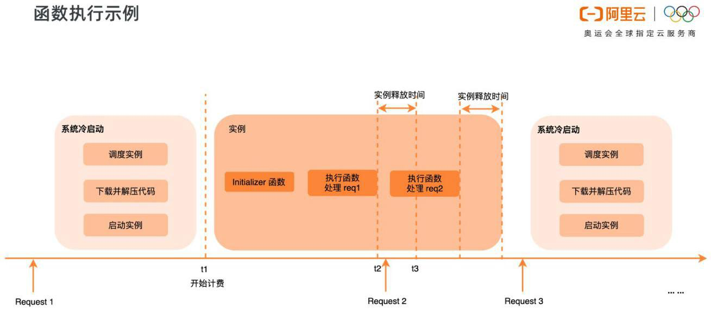
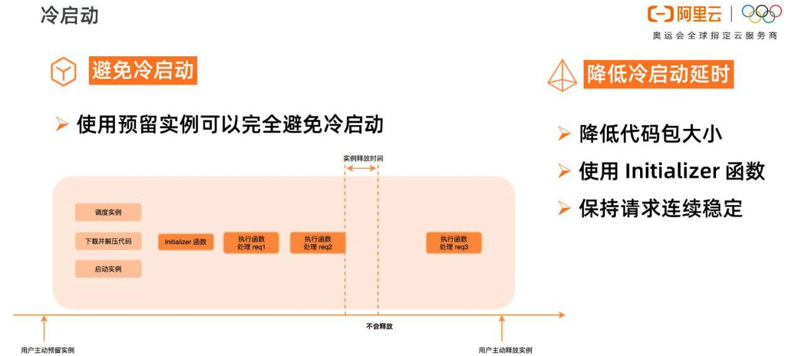
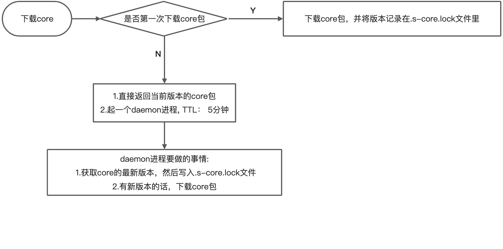

title: 如何搭建自己的个人网站
speaker: 史华力
url: https://github.com/xsahxl/ppt

<slide  class="bg-black-blue aligncenter" image="https://cn.bing.com/az/hprichbg/rb/RainierDawn_EN-AU3730494945_1920x1080.jpg .dark">

# 如何搭建自己的个人网站

<div class="alignright" style="padding-right: 50px;">传统方式 和 serverless</div>

<div style="margin-top: 32px;">[:fa-github: Github](https://github.com/xsahxl/ppt){.button.ghost.animated.flipInX.delay-500}</div>

<div class="alignright" style="margin-top: 100px;padding-right: 50px;">分享人：史华力</div>

<slide style="padding: 16px">

# 传统方式

#### 静态 ui 选型

- [hexo](https://hexo.io/zh-cn/)
- [vuepress](https://vuepress.vuejs.org/zh/)
- [dumi](https://d.umijs.org/zh-CN)

#### 部署

- [GitHub Pages](https://pages.github.com/)
- [云服务器](https://ecs.console.aliyun.com/)

##### <div style="margin-top:32px;">静态网站搭建 以 dumi 和 GitHub Pages 为例子进行演示</div>

##### <div style="margin-top:32px;">动态网站搭建 以 react+axios 和 egg+mongodb 为例子进行演示</div>

<slide  image="https://webslides.tv/static/images/iphone-hand.png .right-bottom">

## [dumi](https://d.umijs.org/)

环境准备

首先得有 node，并确保 node 版本是 10.13 或以上。

```
node -v
```

仓库模板初始化

我们也可以使用 dumi-template 仓库进行初始化，访问 [dumi-template ](https://github.com/umijs/dumi-template) 了解更多。

<slide style="padding: 16px">

## [GitHub Pages](https://pages.github.com/)

Head over to GitHub and create a new public repository named username.github.io, where username is your username (or organization name) on GitHub.

部署

1.在 `.umirc.ts` 中设置正确的 `base`。

如果你打算发布到 `https://<USERNAME>.github.io/`，则可以省略这一步，因为 `base` 和 `publicPath` 默认即是 `"/"`。

如果你打算发布到 `https://<USERNAME>.github.io/<REPO>/`（也就是说你的仓库在 `https://github.com/<USERNAME>/<REPO>`），则将 `base` 和 `publicPath` 设置为 `"/<REPO>/"`。

<slide style="padding: 16px">

2.在你的项目中，创建一个如下的 `deploy.sh` 文件（请自行判断去掉高亮行的注释）:

```shell {.animated.fadeInUp}
#!/usr/bin/env sh

# 确保脚本抛出遇到的错误
set -e

# 生成静态文件
npm run build

# 进入生成的文件夹
cd docs-dist

# 如果是发布到自定义域名
# echo 'www.example.com' > CNAME

git init
git add -A
git commit -m 'deploy'

# 如果发布到 https://<USERNAME>.github.io
# git push -f git@github.com:xsahxl/xsahxl.github.io.git master

# 如果发布到 https://<USERNAME>.github.io/<REPO>
git push -f git@github.com:xsahxl/blog.git master:gh-pages

cd -
```

<slide style="padding: 16px">

## nignx

安装

```
yum install nginx -y
```

启动 nginx

```
nginx
```

阿里云 ecs 服务器的默认开放端口没有 80,记得在安全组里添加下，然后 访问公网 ip 应该会看到 nginx 启动成功了，显然这时候也可以部署我们的静态博客了。

<slide style="padding: 16px">

## 云服务器如何上传文件

[安装 SecureCRT](https://www.jianshu.com/p/983f2f226579)

rz 与 sz 命令

安装

```
yum install lrzsz -y
```

rz 命令（Receive ZMODEM），使用 ZMODEM 协议，将本地文件批量上传到远程 Linux/Unix 服务器，注意不能上传文件夹。
当我们使用虚拟终端软件，如 Xshell、SecureCRT 或 PuTTY 来连接远程服务器后，使用 rz 命令可以上传本地文件到远程服务器。输入 rz 回车后，会出现文件选择对话框，选择需要上传文件，一次可以指定多个文件，上传到服务器的路径为当前执行 rz 命令的目录。

sz 命令（Send ZMODEM）通过 ZMODEM 协议，可将多个文件从远程服务器下载到本地。注意不能下载文件夹，如果下载文件夹，请先打包再下载

<slide style="padding: 16px">

## 部署 node 环境

rz 上传 node 包
解压 node 包

```
tar -xvf node-v14.15.5-linux-x64.tar.xz
```

将文件移动到 /usr/local 目录下

```
mv node-v14.15.5-linux-x64 /usr/local/node
```

检验 node 是否安装成功

```
node -v
```

软连接

```
ln -s /usr/local/node/bin/node /usr/local/bin
ln -s /usr/local/node/bin/npm /usr/local/bin
```

再次执行 node -v 就可以看到版本号了

<slide style="padding: 16px">

## 安装 cnpm

```
npm install -g cnpm --registry=https://registry.npm.taobao.org
```

后续安装的包，添加软链接同 node

<slide style="padding: 16px">

[express](https://www.expressjs.com.cn/starter/hello-world.html)

pm2 是一个进程管理工具,可以用它来管理你的 node 进程，并查看 node 进程的状态，当然也支持性能监控，进程守护，负载均衡等功能

```
 npm install pm2 -g
```

启动进程/应用

```
 pm2 start helloworld.js
```

列出所有进程/应用

```
 pm2 list
```

删除进程/应用

```
 pm2 delete id
```

<slide style="padding: 16px">

## mongodb

```
数据库（database）
集合（collection）
文档（document）
在MongoDB中，数据库和集合都不需要手动创建，当我们创建文档时，如果文档所在的数据库或集合不存在，会自动创建数据库和集合
基本指令
show dbs(databases): 显示当前的所以数据库
use 数据库名称：进入到指定的数据库当中
db：表示的是当前所处的数据库
show collections：显示数据库中所有的集合
db.dropDatabase()：输出数据库
db.<collection>.drop(): 删除集合
数据库的CRUD（增删改查）的操作
create: db.<collection>.insert(doc)
read: db.<collection>.find()
update: db.<collection>.update():
delete: db.<collection>.remove():
```

[下载资源](https://www.mongodb.com/try/download/community), 注意查看服务器的操作系统，请确保下载正确的版本

<slide style="padding: 16px">

解压

```
tar -zxvf mongodb-linux-x86_64-rhel80-4.4.4.tgz
```

将解压后的文件夹移动至指定目录

```
mv mongodb-linux-x86_64-rhel80-4.4.4 /usr/local/mongodb
```

创建数据文件夹、日志文件和 mongo 配置文件

```
mkdir -p  /usr/local/mongodb/data
touch /usr/local/mongodb/mongod.log
touch /usr/local/mongodb/mongodb.conf
```

修改配置文件

```
vim /usr/local/mongodb/mongodb.conf
```

<slide style="padding: 16px">

在配置文件中加入如下代码：

```
dbpath=/usr/local/mongodb/data
logpath=/usr/local/mongodb/mongod.log
logappend = true
bind_ip = 0.0.0.0
port = 27017
fork = true
```

进入到安装目录下

```
cd /usr/local/mongodb/bin
```

启动

```
./mongod --config /usr/local/mongodb/mongodb.conf
```

关闭

```
./mongod -shutdown -dbpath=/usr/local/mongodb/data
```

<slide style="padding: 16px">

软连接

```
ln -s /usr/local/mongodb/bin/mongo /usr/local/bin
```

查看 mongo 进程 第二列就是进程 id

```
ps -ef|grep mongo
```

结束进程

```
kill id
```

<slide style="padding: 16px">

## egg 部署

将本地文件除了 node_modules 进行压缩，并命名为 dist.zip

将文件上传到云服务器

解压文件

```
unzip dist.zip
```

安装依赖

```
npm install --production
```

启动

```
npm start
```

<slide style="padding: 16px">

查看当前端口是否占用

```
lsof -i tcp:7001

```

结束进程

```
kill pid
```

这时候访问 公网 ip + 7001 就可以了

<slide style="padding: 16px">

Nginx 配置

```
location / {
  proxy_set_header Upgrade $http_upgrade;
  proxy_set_header Connection "upgrade";
  proxy_set_header X-Forwarded-For $proxy_add_x_forwarded_for;
  proxy_set_header Host $host;
  proxy_pass   http://127.0.0.1:7001;

  # http://nginx.org/en/docs/http/ngx_http_proxy_module.html#proxy_bind
  # proxy_bind       $remote_addr transparent;
}
```

这时候访问 公网 ip 就可以了

<slide style="padding: 16px;">

# serverless 如何部署静态网站呢？

- 根路径下添加 s.yaml 文件

```yaml
edition: 1.0.0
access: default

services:
  website-starter:
    component: devsapp/website
    actions:
      pre-deploy:
        - run: npm run build
          path: ./
    props:
      bucket: shl-blog
      src:
        publishDir: ./docs-dist
        index: index.html
      region: cn-hangzhou
      hosts:
        - host: blog.shihuali.top
```

- s deploy

<slide style="padding: 16px;">

# Serverless 简介

<br >
'Serverless' 直译过来是 '无服务器' 的意思，但并不是真的没有服务器，这里的 '无' 我们要理解为 开发者不在需要关注服务器的运营和维护工作，只需要关注自己业务代码上的逻辑实现

在传统 Serverful 架构下，部署一个应用需要购买服务器，部署操作系统，搭建开发环境，编写代码，构建应用，部署应用，配置负载均衡机制，搭建日志分析与监控系统，应用上线后，继续监控应用的运行情况。而在 Serverless 架构下，开发者只需要关注应用的开发构建和部署，无需关心服务器相关操作与运维，把精力投入到更有意义的业务开发上。

- 根据 [CNCF 白皮书](https://github.com/cncf/wg-serverless/tree/master/whitepapers/serverless-overview#what-is-serverless-computing) 提到，Serverless 是指构建和运行不需要服务器管理的应用程序的概念。

- 从技术角度来说，Serverless 就是 FaaS 和 BaaS 的结合。

<slide style="padding: 16px">
# Serverless = FaaS + BaaS


- FaaS（Function as a Service） 就是一些运行函数的平台，比如阿里云的函数计算、AWS 的 Lambda 等。
- BaaS（Backend as a Service）则是一些后端云服务，比如云数据库、对象存储、消息队列等。利用 BaaS，可以极大简化我们的应用开发难度。
- Serverless 则可以理解为运行在 FaaS 中的，使用了 BaaS 的函数。

<slide>

# Serverless 的主要特点

- 事件驱动
  - 函数在 FaaS 平台中，需要通过一系列的事件来驱动函数执行。
- 无状态
  - 因为每次函数执行，可能使用的都是不同的容器，无法进行内存或数据共享。如果要共享数据，则只能通过第三方服务，比如 ots 等。
- 无运维
  - 使用 Serverless 我们不需要关心服务器，不需要关心运维。这也是 Serverless 思想的核心。
- 弹性扩容
  - 函数计算根据请求量自动进行弹性扩容，无需任何手动配置。
  - 毫秒级调度计算资源，轻松应对业务洪峰。
- 低成本
  - 使用 Serverless 成本很低，因为我们只需要为每次函数的运行付费。函数不运行，则不花钱，也不会浪费服务器资源

<slide style="padding: 16px">

# Serverless 的缺点

- 云厂商强绑定
  - 它们常常会和厂商的其他云产品相绑定，如对象存储、消息队列等，意味你需要同时开通其他的服务，迁移成本高
- 不适合长时间任务
  - 云函数平台会限制函数执行时间
- 冷启动时间
  - 函数运行时，执行容器和环境需要一定的时间，对 HTTP 请求来讲，可能会带来响应时延的增加
- 本地调试困难
  - 开发者需要不断调整代码，打印日志，并提交到函数平台运行测试

<slide style="padding: 16px">

# 函数计算使用场景

从使用场景来说，主要有三类

- Web 应用, 可以是各种语言写的，这种可以是使用 Serverless 框架新编写的程序, 也可以是已有的应用。比如可能是小程序后端，也可能是 Web API
- 对计算能力有很强的弹性诉求的应用, 比如 AI 推理、音视频处理、图文转换等
- 事件驱动型的应用, 比如通过其他阿里云产品驱动的场景、Web Hook、定时任务等

函数计算已经与很多产品进行了打通，比如对象存储、表格存储、定时器、CDN、日志服务、云监控等十几个产品，可以非常快速地组装出一些业务逻辑。

<slide style="padding: 16px">

##### 函数计算执行过程



如上图所示，当函数第一次被调用的时候，函数计算需要动态调度实例、下载代码、解压代码、启动实例，得到一个可执行函数的代码环境。然后才开始在系统分配的实例中真正地执行用户的初始化函数，执行函数业务逻辑。这个调度实例启动实例的过程，就是系统的冷启动过程。

函数逻辑执行结束后，不会立即释放掉实例，会等一段时间，如果在这段时间内有新的调用，会复用这个实例，比如上图中的 Request 2，由于执行环境已经分配好了，Request 2 可以直接使用，所以 Request 2 就不会遇到冷启动。

Request 2 执行结束后，等待一段时间，如果这段时间没有新的请求分配到这个实例上，那系统会回收实例，释放执行环境。此实例释放后，新的请求 Request 3 来到函数计算，需要重新调度实例、下载代码、解压代码，启动实例，又会遇到冷启动。

所以，为了减小冷启动带来的影响，要尽可能避免冷启动，降低冷启动带来的延时。

<slide style="padding: 16px">


使用预留实例可以完全避免冷启动，预留实例是在用户预留后就分配实例，准备执行环境；请求结束后系统也不会自动回收实例。

预留实例不由系统自动分配与回收，由用户控制实例的生命周期，可以长驻不销毁，这将彻底消除实例冷启动带来的延时毛刺，提供极致性能，也为在线应用迁移至函数计算扫清障碍。

如果业务场景不适合使用 [预留实例](https://help.aliyun.com/document_detail/138103.html)，那就要设法降低冷启动的延时，比如降低代码包大小，可以降低下载代码包、解压代码包的时间。Initializer 函数是实例的初始化函数，Initializer 在同一实例中执行且只执行一次，所以可以将一些耗时的公共逻辑放到 Initializer 中，比如在 数据库的连接等。另外要尽量保持请求连续稳定，避免突发的流量，由于系统已启动的实例不足以支撑大量的突发流量，就会带来不可避免的冷启动。

<slide style="padding: 16px">

##### 体验一下 website-react

```bash
bogon:a shihuali$ s init website-react

🚀 Serverless Awesome: https://github.com/Serverless-Devs/package-awesome

? Please input your project name (init dir) website-react
✔ file decompression completed
? Do you want to install dependencies? No
? please input alibaba oss bucket: website-react-bucket
? please select credential alias default

🏄‍ Thanks for using Serverless-Devs
👉 You could [cd /Users/shihuali/workspace/a/website-react] and enjoy your serverless journey!
🧭️ If you need help for this example, you can use [s -h] after you enter folder.
💞 Document ❤ Star：https://github.com/Serverless-Devs/Serverless-Devs

# s deploy success output
domainName: http://website-react-bucket.oss.devsapp.net
website-starter:
  Region: cn-hangzhou
  Bucket: website-react-bucket
  Domains:
    - website-react-bucket.oss.devsapp.net
```

- s init website-react, 对于这个下载动作其实是调用了 core 提供的 loadApplocation 方法

<slide style="padding: 16px">

##### Yaml 规范

```yaml
edition: 1.0.0 #  命令行YAML规范版本，遵循语义化版本（Semantic Versioning）规范
name: FullStack #  项目名称
access: xxx-account1 #  秘钥别名
vars: # [全局变量，提供给各个服务使用]
  logo: https://image.aliyun.com/xxxx.png
  domain: xxxx.yyy.com
services:
  nextjs-portal: #  服务名称
    access: xxx-account1 #  秘钥别名，如果和项目的access相同，可省略
    component: vue-component # 组件名称
    props: #  组件的属性值
      src: ./frontend_src
      url: url
    actions: # 自定义执行逻辑
      pre-deploy: # 在deploy之前运行
        - run: s exec -- publish # 要运行的命令行
          path: ./backend_src # 命令行运行的路径
        - plugin: plugin-name # 要运行的plugin名称
      post-deploy: # 在deploy之后运行
        - run: s clean
          path: ./frontend_src
  express-blog:
    component: express
    props:
      app: ./express-blog
      url: ${vars.domain}
    actions:
      pre-deploy:
        - run: npm run build
          path: ./express-blog
```

<slide style="padding: 16px">

Yaml 支持的多种变量格式如下：

- <div>获取当前机器中的环境变量：${env(环境变量)}，例如${env(secretId)}</div>
- <div>获取全局变量：${vars.*}</div>
- <div>获取其他项目的变量：${projectName.props.*}</div>
- <div>获取 Yaml 中其他项目的结果变量：${projectName.output.*}</div>

当然，如果一个 Yaml 中有过多的项目，系统也会默认分析部署顺序：

- 分析项目中的依赖关系
- 有依赖关系的按照依赖关系从前到后部署，无依赖关系的按 Yaml 配置的从上到下部署

<slide style="padding: 16px">

##### core 的更新机制



<slide style="padding: 16px">

##### 组件的加载机制


<slide class="bg-black-blue aligncenter" image="https://source.unsplash.com/C1HhAQrbykQ/">

## THANK YOU

<div style="display: flex;justify-content: center; margin-top: 16px;">
  <div style="border: 1px dashed #eee; padding: 16px;">
    <h5>传统方式</h5>
    <div style="display: flex;justify-content: center;">
      <div>
        <h3>静态网站</h3>
        <div style="margin-top: 16px;">[demo 演示](https://xsahxl.github.io){.button.delay-1s.animated.fadeInUp}</div>
        <div style="margin-top: 32px;">[:fa-cloud-download: Github](https://github.com/xsahxl/xsahxl.github.io){.button.delay-1s.animated.fadeInUp}
        </div>
      </div>
      <div style="margin-left: 56px;">
        <h3>动态网站</h3>
        <div style="margin-top: 16px;">[demo 演示](https://app.shihuali.top){.button.delay-2s.animated.fadeInUp}</div>
        <div style="margin-top: 32px;">[:fa-cloud-download: Github](https://github.com/learn-one-app){.button.animated.delay-2s.fadeInUp}
        </div>
      </div>
    </div>
  </div>
  <div style="margin-left: 56px;border: 1px dashed #eee; padding: 16px;">
    <h5>serverless</h5>
    <div style="display: flex;justify-content: center;">
      <div>
        <h3>静态网站</h3>
        <div style="margin-top: 16px;">[demo 演示](https://blog.shihuali.top){.button.delay-3s.animated.fadeInUp}</div>
        <div style="margin-top: 32px;">[:fa-cloud-download: Github](https://github.com/xsahxl/blog){.button.delay-3s.animated.fadeInUp}
        </div>
      </div>
      <div style="margin-left: 56px;">
        <h3>动态网站</h3>
        <div style="margin-top: 16px;">[demo 演示](http://jamstack-react-project-87b63120f252eeb2d9b99bb406750fea.jamstack.devsapp.net){.button.delay-4s.animated.fadeInUp}</div>
        <div style="margin-top: 32px;">[:fa-cloud-download: Github](https://github.com/learn-one-app){.button.animated.delay-4s.fadeInUp}
        </div>
      </div>
    </div>
  </div>
</div>
