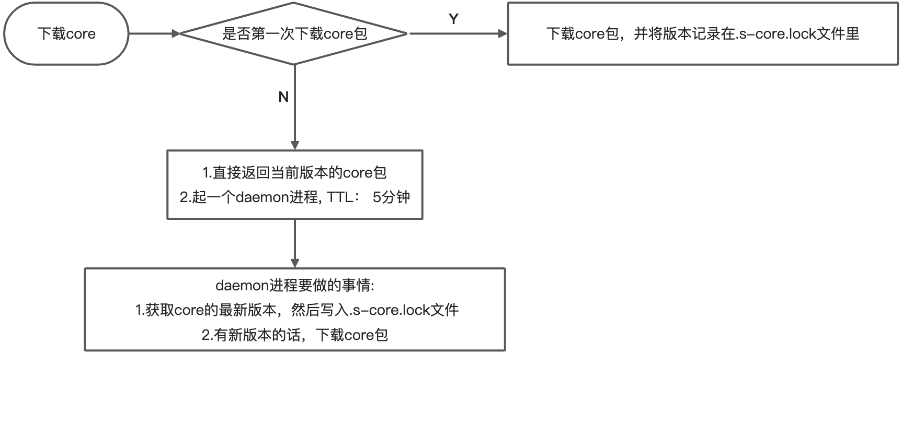

title: Serverless 入门
speaker: 史华力
url: https://github.com/xsahxl/ppt

<slide  class="bg-black-blue aligncenter" image="https://cn.bing.com/az/hprichbg/rb/RainierDawn_EN-AU3730494945_1920x1080.jpg .dark">

# Serverless 入门

<div style="margin-top: 32px;">[:fa-github: Github](https://github.com/xsahxl/ppt){.button.ghost.animated.flipInX.delay-500}</div>

### <div style="margin-top: 100px;text-align: right;">分享人：史华力</div>

<slide style="padding: 16px;">

# Serverless 简介

<br >
'Serverless' 直译过来是 '无服务器' 的意思，但并不是真的没有服务器，这里的 '无' 我们要理解为 开发者不在需要关注服务器的运营和维护工作，只需要关注自己业务代码上的逻辑实现

在传统 Serverful 架构下，部署一个应用需要购买服务器，部署操作系统，搭建开发环境，编写代码，构建应用，部署应用，配置负载均衡机制，搭建日志分析与监控系统，应用上线后，继续监控应用的运行情况。而在 Serverless 架构下，开发者只需要关注应用的开发构建和部署，无需关心服务器相关操作与运维，把精力投入到更有意义的业务开发上。

- 根据 [CNCF 白皮书](https://github.com/cncf/wg-serverless/tree/master/whitepapers/serverless-overview#what-is-serverless-computing) 提到，Serverless 是指构建和运行不需要服务器管理的应用程序的概念。

- 从技术角度来说，Serverless 就是 FaaS 和 BaaS 的结合。

<slide style="padding: 16px">
# Serverless = FaaS + BaaS


- FaaS（Function as a Service） 就是一些运行函数的平台，比如阿里云的函数计算、AWS 的 Lambda 等。
- BaaS（Backend as a Service）则是一些后端云服务，比如云数据库、对象存储、消息队列等。利用 BaaS，可以极大简化我们的应用开发难度。
- Serverless 则可以理解为运行在 FaaS 中的，使用了 BaaS 的函数。

<slide>

# Serverless 的主要特点

- 事件驱动
  - 函数在 FaaS 平台中，需要通过一系列的事件来驱动函数执行。
- 无状态
  - 因为每次函数执行，可能使用的都是不同的容器，无法进行内存或数据共享。如果要共享数据，则只能通过第三方服务，比如 ots 等。
- 无运维
  - 使用 Serverless 我们不需要关心服务器，不需要关心运维。这也是 Serverless 思想的核心。
- 弹性扩容
  - 函数计算根据请求量自动进行弹性扩容，无需任何手动配置。
  - 毫秒级调度计算资源，轻松应对业务洪峰。
- 低成本
  - 使用 Serverless 成本很低，因为我们只需要为每次函数的运行付费。函数不运行，则不花钱，也不会浪费服务器资源

<slide style="padding: 16px">

# Serverless 的缺点

- 云厂商强绑定
  - 它们常常会和厂商的其他云产品相绑定，如对象存储、消息队列等，意味你需要同时开通其他的服务，迁移成本高
- 不适合长时间任务
  - 云函数平台会限制函数执行时间
- 冷启动时间
  - 函数运行时，执行容器和环境需要一定的时间，对 HTTP 请求来讲，可能会带来响应时延的增加
- 本地调试困难
  - 开发者需要不断调整代码，打印日志，并提交到函数平台运行测试

<slide style="padding: 16px">

# 函数计算使用场景

从使用场景来说，主要有三类

- Web 应用, 可以是各种语言写的，这种可以是使用 Serverless 框架新编写的程序, 也可以是已有的应用。比如可能是小程序后端，也可能是 Web API
- 对计算能力有很强的弹性诉求的应用, 比如 AI 推理、音视频处理、图文转换等
- 事件驱动型的应用, 比如通过其他阿里云产品驱动的场景、Web Hook、定时任务等

函数计算已经与很多产品进行了打通，比如对象存储、表格存储、定时器、CDN、日志服务、云监控等十几个产品，可以非常快速地组装出一些业务逻辑。

<slide style="padding: 16px">

##### 函数计算执行过程


如上图所示，当函数第一次被调用的时候，函数计算需要动态调度实例、下载代码、解压代码、启动实例，得到一个可执行函数的代码环境。然后才开始在系统分配的实例中真正地执行用户的初始化函数，执行函数业务逻辑。这个调度实例启动实例的过程，就是系统的冷启动过程。

函数逻辑执行结束后，不会立即释放掉实例，会等一段时间，如果在这段时间内有新的调用，会复用这个实例，比如上图中的 Request 2，由于执行环境已经分配好了，Request 2 可以直接使用，所以 Request 2 就不会遇到冷启动。

Request 2 执行结束后，等待一段时间，如果这段时间没有新的请求分配到这个实例上，那系统会回收实例，释放执行环境。此实例释放后，新的请求 Request 3 来到函数计算，需要重新调度实例、下载代码、解压代码，启动实例，又会遇到冷启动。

所以，为了减小冷启动带来的影响，要尽可能避免冷启动，降低冷启动带来的延时。

<slide style="padding: 16px">


使用预留实例可以完全避免冷启动，预留实例是在用户预留后就分配实例，准备执行环境；请求结束后系统也不会自动回收实例。

预留实例不由系统自动分配与回收，由用户控制实例的生命周期，可以长驻不销毁，这将彻底消除实例冷启动带来的延时毛刺，提供极致性能，也为在线应用迁移至函数计算扫清障碍。

如果业务场景不适合使用 [预留实例](https://help.aliyun.com/document_detail/138103.html)，那就要设法降低冷启动的延时，比如降低代码包大小，可以降低下载代码包、解压代码包的时间。Initializer 函数是实例的初始化函数，Initializer 在同一实例中执行且只执行一次，所以可以将一些耗时的公共逻辑放到 Initializer 中，比如在 数据库的连接等。另外要尽量保持请求连续稳定，避免突发的流量，由于系统已启动的实例不足以支撑大量的突发流量，就会带来不可避免的冷启动。

<slide style="padding: 16px">

##### 体验一下 website-react

```bash
bogon:a shihuali$ s init website-react

🚀 Serverless Awesome: https://github.com/Serverless-Devs/package-awesome

? Please input your project name (init dir) website-react
✔ file decompression completed
? Do you want to install dependencies? No
? please input alibaba oss bucket: website-react-bucket
? please select credential alias default

🏄‍ Thanks for using Serverless-Devs
👉 You could [cd /Users/shihuali/workspace/a/website-react] and enjoy your serverless journey!
🧭️ If you need help for this example, you can use [s -h] after you enter folder.
💞 Document ❤ Star：https://github.com/Serverless-Devs/Serverless-Devs

# s deploy success output
domainName: http://website-react-bucket.oss.devsapp.net
website-starter:
  Region: cn-hangzhou
  Bucket: website-react-bucket
  Domains:
    - website-react-bucket.oss.devsapp.net
```

- s init website-react, 对于这个下载动作其实是调用了 core 提供的 loadApplocation 方法

<slide style="padding: 16px">

##### Yaml 规范

```yaml
edition: 1.0.0 #  命令行YAML规范版本，遵循语义化版本（Semantic Versioning）规范
name: FullStack #  项目名称
access: xxx-account1 #  秘钥别名
vars: # [全局变量，提供给各个服务使用]
  logo: https://image.aliyun.com/xxxx.png
  domain: xxxx.yyy.com
services:
  nextjs-portal: #  服务名称
    access: xxx-account1 #  秘钥别名，如果和项目的access相同，可省略
    component: vue-component # 组件名称
    props: #  组件的属性值
      src: ./frontend_src
      url: url
    actions: # 自定义执行逻辑
      pre-deploy: # 在deploy之前运行
        - run: s exec -- publish # 要运行的命令行
          path: ./backend_src # 命令行运行的路径
        - plugin: plugin-name # 要运行的plugin名称
      post-deploy: # 在deploy之后运行
        - run: s clean
          path: ./frontend_src
  express-blog:
    component: express
    props:
      app: ./express-blog
      url: ${vars.domain}
    actions:
      pre-deploy:
        - run: npm run build
          path: ./express-blog
```

<slide style="padding: 16px">

Yaml 支持的多种变量格式如下：

- <div>获取当前机器中的环境变量：${env(环境变量)}，例如${env(secretId)}</div>
- <div>获取全局变量：${vars.*}</div>
- <div>获取其他项目的变量：${projectName.props.*}</div>
- <div>获取 Yaml 中其他项目的结果变量：${projectName.output.*}</div>

当然，如果一个 Yaml 中有过多的项目，系统也会默认分析部署顺序：

- 分析项目中的依赖关系
- 有依赖关系的按照依赖关系从前到后部署，无依赖关系的按 Yaml 配置的从上到下部署

<slide style="padding: 16px">

##### core 的更新机制



<slide style="padding: 16px">

##### 组件的加载机制


<slide style="padding: 16px">

# 感谢，已完结
